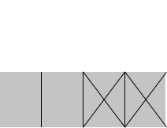
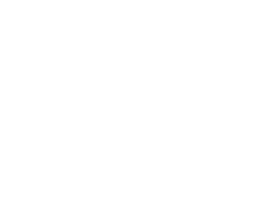

### Binary search

So for binary search, you have to check log<sub>n</sub> elements in the worst case.

For a list of 8 elements, _log(8) = 3_, because _2<sup>3</sup> = 8_

* _log<sub>2</sub>(8) = 3_

So for a list of 8 numbers you would have to check 3 numbers at most.

For a list of 1024 elements _log(1024) = 10_, because _2<sup>10</sup> = 1024_

* _log<sub>2</sub>(1024) = 10_

So for a list of 1024 numbers, you'd have to check 10 numbers at most.


^ In the context of Big O notation, log always mean log<sub>2</sub>

More on [logarithms](../../logarithms/README.md)

```python
def binary_search(arg: list, item: int):
    low = 0
    high = len(arg) - 1
    while low <= high:
        mid = (low + high)
        guess = arg[mid]
        if guess == item:
            return mid
        if guess > item:
            high = mid - 1
        else:
            low = mid + 1
    return None
```


### Simple search vs binary search

#### Run times


